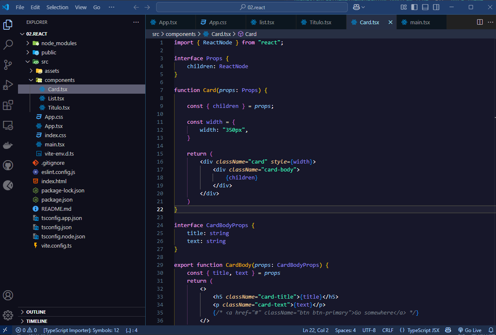

# Visual Studio Code Theme

**Blue Theme** is a dark theme for Visual Studio Code, designed to provide a visually appealing and comfortable coding experience. It features carefully selected colors for syntax highlighting, UI elements, and semantic tokens to enhance readability and focus.



## Features

- **Dark Background**: Reduces eye strain during long coding sessions.
- **Vivid Syntax Highlighting**: Distinct colors for keywords, variables, functions, and more.
- **Semantic Highlighting**: Supports advanced token-based highlighting for better code understanding.
- **Custom UI Colors**: Tailored colors for the activity bar, sidebars, editor, and terminal.

## Installation

### Method 1: Using Git (Recommended)

1. Open a terminal or command prompt.
2. Navigate to your VS Code extensions directory:
   - **Windows**: `%USERPROFILE%\.vscode\extensions`
   - **macOS/Linux**: `~/.vscode/extensions`

3. Clone the repository directly into your extensions folder:
   ```bash
   # For Windows
   git clone https://github.com/JonAlvz/blue-theme.git

   # For macOS/Linux
   git clone https://github.com/JonAlvz/blue-theme.git ~/.vscode/extensions/blue-theme
   ```

4. Restart Visual Studio Code.
5. Open the Command Palette (`Ctrl+Shift+P` or `Cmd+Shift+P` on macOS).
6. Type `Preferences: Color Theme` and select it.
7. Select **Blue Theme** from the list of available themes.

### Method 2: Manual Installation

1. Download this repository as a ZIP file from https://github.com/JonAlvz/blue-theme.git
2. Extract the ZIP file.
3. Move or copy the extracted folder to your VS Code extensions directory:
   - **Windows**: `%USERPROFILE%\.vscode\extensions`
   - **macOS/Linux**: `~/.vscode/extensions`
   
   Make sure the folder is named `blue-theme` inside the extensions directory.

4. Restart Visual Studio Code.
5. Open the Command Palette (`Ctrl+Shift+P` or `Cmd+Shift+P` on macOS).
6. Type `Preferences: Color Theme` and select it.
7. Select **Blue Theme** from the list of available themes.

## Customization

If you'd like to tweak the theme, you can edit the `blue-theme-color-theme.json` file located in this folder. After making changes, reload VS Code to see your modifications.

## Troubleshooting

If the theme doesn't appear in the list:
- Make sure the folder is correctly named `blue-theme`
- Check that it's directly inside the extensions directory
- Restart VS Code completely (not just reload)
- Check the VS Code Developer Tools console for any errors

## Feedback

If you encounter any issues or have suggestions for improvement, feel free to open an issue or contribute to the theme.


